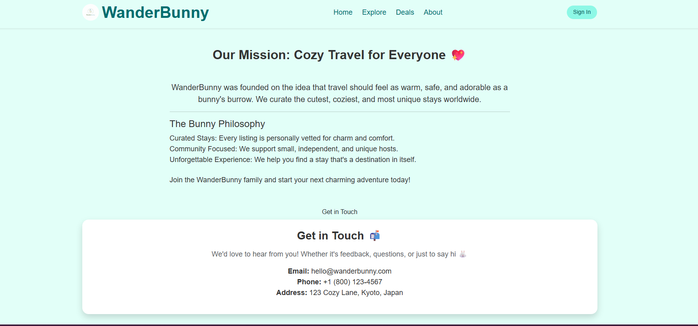
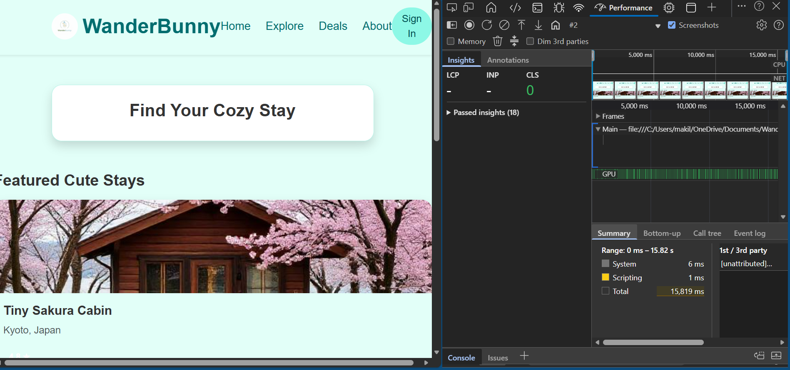
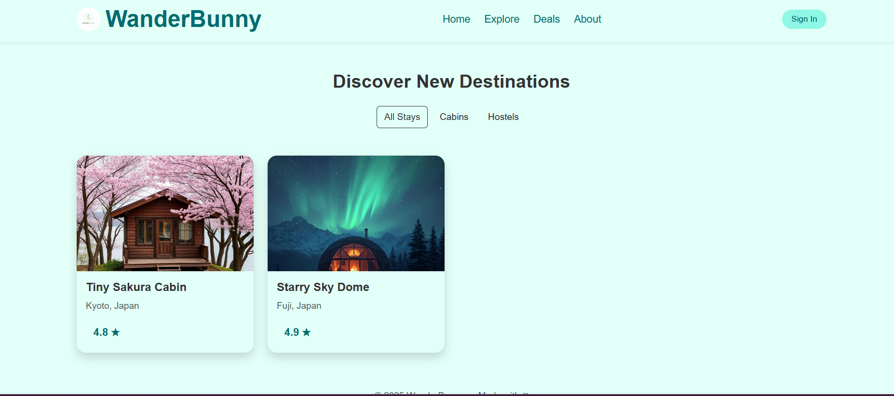
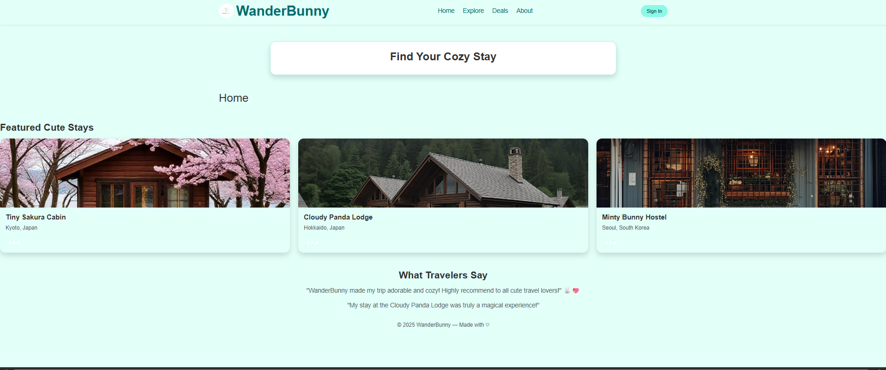
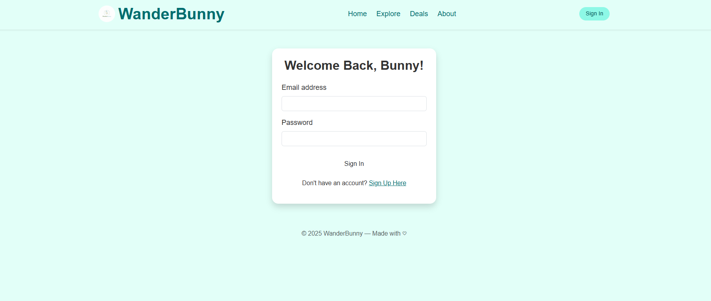
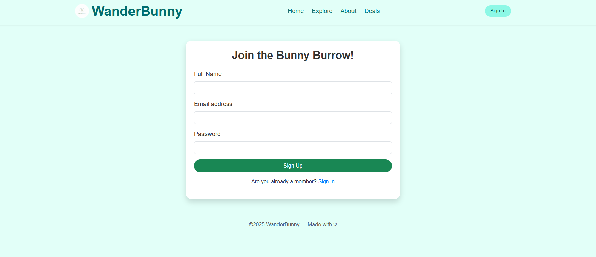
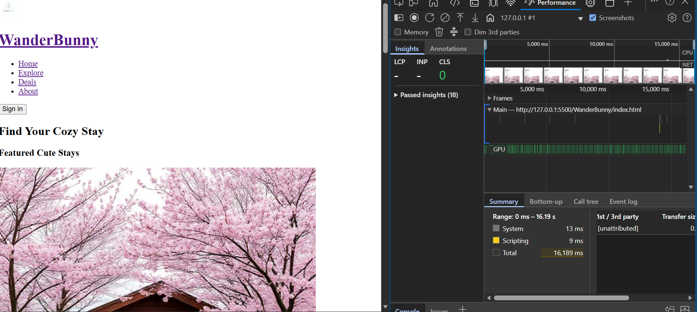
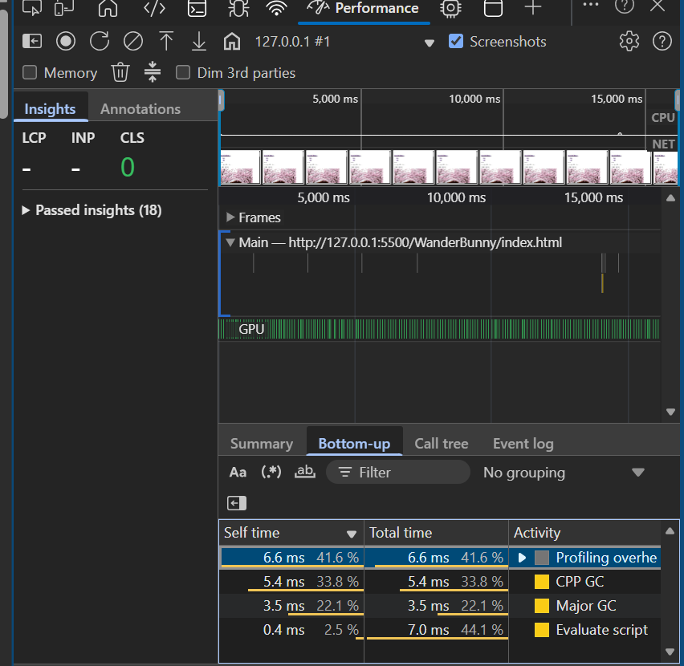

This file contains all of the details about the technical configuration, dependencies, performance, and strategic implementation of the WanderBunny website. WanderBunny is a travel platform that helps find cute and cozy accomodations worldwide.

CDN Provider and Configuration
Cloudflare was used as the primary CDN.
DNS was set to proxy traffic through Cloudflare.
jsDelivr was used to effectively implement Bootstrap framework files directly into the browser.
The loading="lazy" attribute was used to reduce bandwidth.
Non critical scripts were used to avoid blocking the page.

Frameworks and Libraries 
Google Fonts, Poppins
Font awsome for the icons
A custom JavaScript file for the Login in form
Css media queries for a responsive layout

## CDN screenshot

